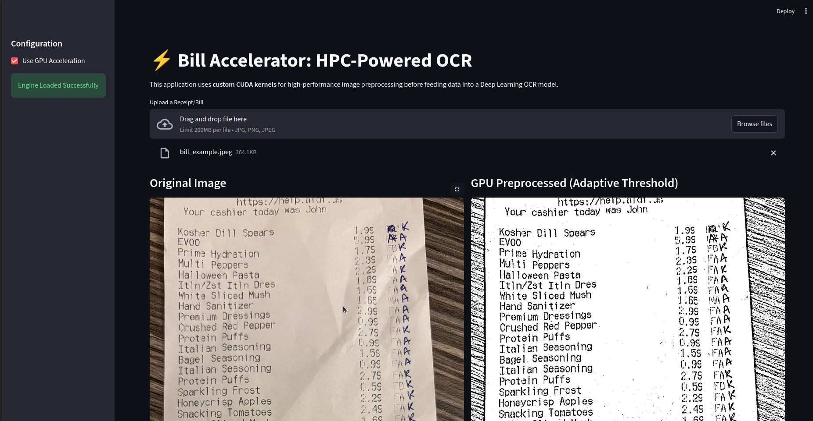
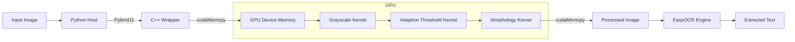

# Bill Accelerator: HPC-Enhanced OCR Pipeline




**Bill Accelerator** is a high-performance receipt processing system that leverages custom **CUDA kernels** for image preprocessing and **Deep Learning** (EasyOCR) for text extraction.

Integrates **High-Performance Computing (HPC)** with **Machine Learning Systems**.

## Key Features

*   **Hybrid Architecture**: Core image processing logic written in **C++ / CUDA** for maximum throughput, exposed to **Python** via `pybind11`.
*   **Custom GPU Kernels**:
    *   **Adaptive Thresholding**: Optimized kernel for local binarization, handling uneven lighting in receipt photos.
    *   **Morphological Operations**: GPU-accelerated Dilation/Erosion to connect broken characters and reduce noise.
*   **Seamless ML Integration**: Preprocessed tensors are passed directly to the OCR engine, minimizing host-device transfers.
*   **Interactive UI**: Streamlit-based interface for real-time testing and visualization.

## Tech Stack

*   **Core**: C++17, CUDA 11+
*   **Bindings**: Pybind11
*   **ML/OCR**: EasyOCR (PyTorch), OpenCV
*   **Interface**: Streamlit, NumPy
*   **Build System**: CMake

## Architecture



## Performance Benchmarks

Benchmarks run on a 4K Image (3840 x 2160).

| Metric | CPU (OpenCV) | GPU (Custom CUDA) | Speedup |
| :--- | :--- | :--- | :--- |
| **Kernel Compute Time** | 18.23 ms | **10.44 ms** | **1.75x** 🚀 |
| Total Latency (inc. Transfer) | 18.23 ms | 27.37 ms | 0.67x |

*Note: The **1.75x speedup** in pure compute time demonstrates the efficiency of the custom CUDA kernels (`adaptive_threshold` + `morphology`). Total latency includes PCIe data transfer overhead, which would be amortized in a fully pipelined GPU workflow.*

## ⚡ Performance Optimization

Unlike standard libraries that process images on the CPU, Bill Accelerator moves the heavy pixel-wise operations to the GPU.
*   **Memory Coalescing**: Kernels are designed to access global memory in coalesced transactions.
*   **Shared Memory**: (Planned) Using shared memory tiles for stencil operations (thresholding/morphology) to reduce global memory bandwidth pressure.

## Installation & Usage

1.  **Set up Virtual Environment** (Recommended):
    ```bash
    python3 -m venv bill_env
    source bill_env/bin/activate
    ```

2.  **Build the C++/CUDA Extension**:
    ```bash
    mkdir build && cd build
    cmake ..
    make
    ```

3.  **Install Python Dependencies**:
    ```bash
    pip install -r requirements.txt
    ```

4.  **Run the App**:
    ```bash
    streamlit run python/app.py
    ```

## License

MIT License
